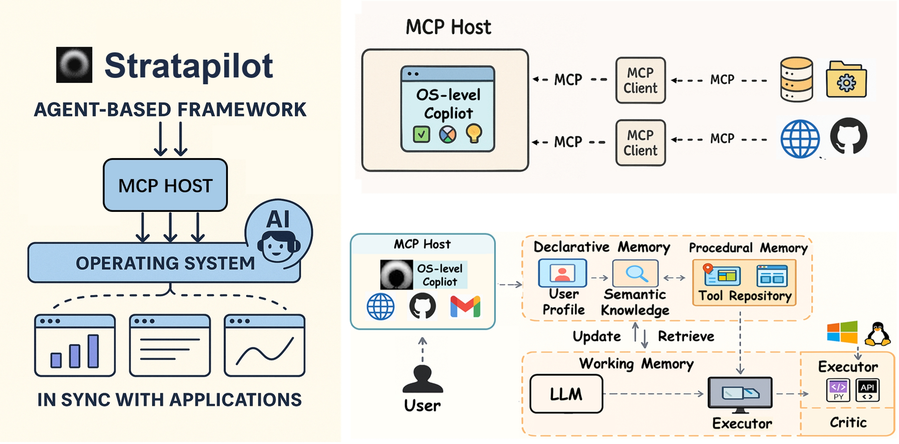
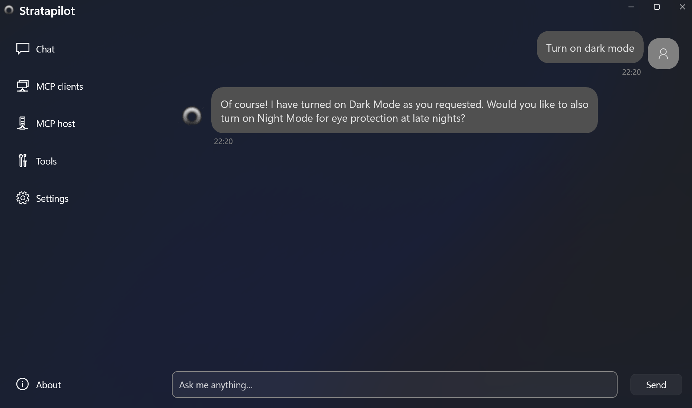

<p align="center">
  
</p>

<div align="center">

<h3><b>Next-gen copilot agent for you OS, powered by MCP</b></h3>

[](https://stratapilot.xyz/)
[](https://stratapilot.readthedocs.io/en/latest/index.html)

[](LICENSE)
[](https://x.com/keaistrata)
[](https://github.com/KAIST-KEAI/stratapilot)

</div>

---

**Stratapilot** is a system-level, general-purpose copilot agent that automates and executes user tasks across applications, files, and interfaces. Designed for OS-native deployment, Stratapilot enables context-aware, multi-modal task execution through natural language input.

At the core of Stratapilot is the **Model Context Protocol (MCP)** — an extensible, application-agnostic protocol that allows Stratapilot to interface with third-party software (both legacy and modern) in a structured, deterministic way. MCP defines a standard for model-to-model and model-to-application communication, making Stratapilot interoperable across tools, services, and agents without requiring custom plugins.



---
### ⚡️ Quickstart

1. **Clone the repository:**
   ```bash
   git clone https://github.com/KAIST-KEAI/stratapilot.git
   ```

2. **Set up Python environment (3.10+):**
   ```bash
   conda create -n stratapilot_env python=3.10 -y
   conda activate stratapilot_env
   ```

3. **Install dependencies:**
   ```bash
   cd stratapilot
   pip install -e .
   ```

4. **Configure your backend LLM API key:**
   Set your LLM provider's API key (e.g., OpenAI) in the `.env` file and select your preferred model.

5. **Run the demo:**
   ```bash
   python quick_start.py
   ```

6. **Set up GUI mode (optional):**

   Specify the default agent prompt in a configuration file named `prompt.conf` and place it in the root directory under the cloned project. You can find an example prompt file in `prompt.py`. After this is done, enable GUI mode and start the program with
   ```bash
   python quick_start.py --gui
   ```

   The prompt in the configuration file is used to fine-tune the agent's behavior upon startup, and will not be visible in the chat history.
   You can then chat with the agent like with any LLM chat bot services.



---
### 🛠️ Advanced Usage

Stratapilot provides a developer SDK for building:

- **Custom MCP Workflows**: Compose complex, multi-step tasks that span filesystems, APIs, user interfaces, and third-party apps. Each workflow is defined declaratively and executed deterministically by the agent engine.
- **Adapters for Legacy Software**: Wrap older desktop or command-line applications with an MCP-compatible interface, enabling structured communication with modern agents without modifying the original software.
- **Headless Agents and Background Tasks**: Run silent or daemon-mode agents that respond to triggers (e.g., cron jobs, file changes, system events) instead of user queries.
- **Plugin-Free Automation**: Stratapilot doesn’t rely on per-app plugins or brittle scripting. With MCP bindings, you can interface with existing applications through their CLI, APIs, sockets, or filesystem I/O.

#### App Integration

Stratapilot supports a variety of integration methods out-of-the-box:
- **File-level automation** (read/write/transform data files)
- **Command-line tool orchestration** (wrap tools like `ffmpeg`, `git`, `curl`, etc.)
- **API interactions** (REST/GraphQL endpoints through typed descriptors)
- **Database queries** (e.g., SQLite, Postgres via connector wrappers)
- **System and window control** (e.g., launching apps, recording input/output state)

See sample code under `examples` for SDK usage demos and integration templates. For more information about tool development using the SDK, refer to Stratapilot's [documentation](https://strata.readthedocs.io/en/latest).

---
### 🤗 Contributing

Stratapilot welcomes contribution in any form! If you are interested in getting involved, refer to our [contribution guidelines](CONTRIBUTING.md).
