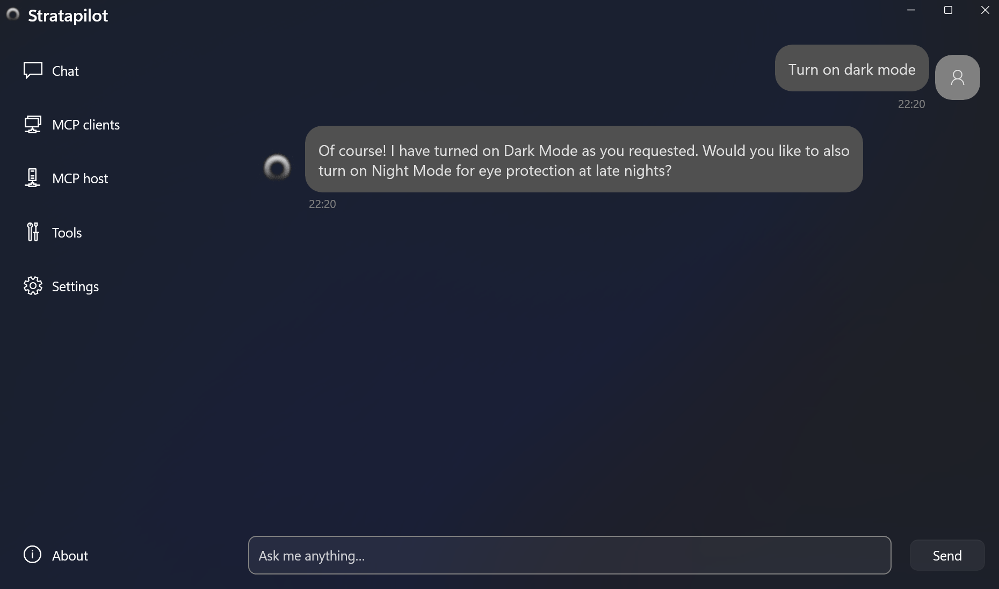

.. container:: centered

   **Next‑gen copilot agent for your OS, powered by MCP**

   .. image:: https://img.shields.io/badge/Homepage-blue?style=flat
      :target: 
      :alt: Homepage
      :class: badge

   .. image:: https://img.shields.io/badge/Documentation-blue?style=flat
      :target: https://strata.readthedocs.io/en/latest
      :alt: Documentation
      :class: badge

   .. image:: https://img.shields.io/badge/License-MIT-silver?style=flat-square
      :target: LICENSE
      :alt: MIT License
      :class: badge

   .. image:: https://img.shields.io/badge/Follow-%40keaistrata-silver?style=flat-square&logo=x
      :target: https://x.com/keaistrata
      :alt: Follow @keaistrata
      :class: badge

   .. image:: https://img.shields.io/github/stars/KAIST-KEAI/stratapilot?style=flat-square&logo=github&label=Stars&color=gold
      :target: https://github.com/KAIST-KEAI/stratapilot
      :alt: GitHub Stars
      :class: badge


----

**Stratapilot** is a system-level, general-purpose copilot agent that automates and executes user tasks across applications, files, and interfaces. Designed for OS‑native deployment, Stratapilot enables context-aware, multi-modal task execution through natural language input.

At the core of Stratapilot is the **Model Context Protocol (MCP)** — an extensible, application-agnostic protocol that allows Stratapilot to interface with third-party software (both legacy and modern) in a structured, deterministic way. MCP defines a standard for model-to-model and model-to-application communication, making Stratapilot interoperable across tools, services, and agents without requiring custom plugins.

.. image:: _static/arch.png
   :alt: Architecture Diagram
   :align: center

----

⚡️ Quickstart
-------------

1. **Clone the repository:**

   .. code-block:: bash

      git clone https://github.com/KAIST-KEAI/stratapilot.git

2. **Set up Python environment (3.10+):**

   .. code-block:: bash

      conda create -n stratapilot_env python=3.10 -y
      conda activate stratapilot_env

3. **Install dependencies:**

   .. code-block:: bash

      cd stratapilot
      pip install -e .

4. **Configure your backend LLM API key:**

   Set your LLM provider’s API key (e.g., OpenAI) in the `.env` file and select your preferred model.

5. **Run the demo:**

   .. code-block:: bash

      python quick_start.py

6. **Set up GUI mode (optional):**

   Specify the default agent prompt in a configuration file named `prompt.conf` and place it in the root directory under the cloned project. You can find an example prompt file in `prompt.py`. After this is done, enable GUI mode and start the program with:

   .. code-block:: bash

      python quick_start.py --gui

   The prompt in the configuration file is used to fine-tune the agent’s behavior upon startup and will not be visible in the chat history. You can then chat with the agent as with any LLM chatbot service.



----

🛠️ Advanced Usage
------------------

Stratapilot provides a developer SDK for building:

- **Custom MCP Workflows**: Compose complex, multi-step tasks that span filesystems, APIs, user interfaces, and third-party apps. Each workflow is defined declaratively and executed deterministically by the agent engine.
- **Adapters for Legacy Software**: Wrap older desktop or command-line applications with an MCP-compatible interface, enabling structured communication with modern agents without modifying the original software.
- **Headless Agents and Background Tasks**: Run silent or daemon-mode agents that respond to triggers (e.g., cron jobs, file changes, system events) instead of user queries.
- **Plugin-Free Automation**: Stratapilot doesn’t rely on per-app plugins or brittle scripting. With MCP bindings, you can interface with existing applications through their CLI, APIs, sockets, or filesystem I/O.

App Integration
~~~~~~~~~~~~~~~

Stratapilot supports a variety of integration methods out-of-the-box:

- **File-level automation** (read/write/transform data files)
- **Command-line tool orchestration** (wrap tools like `ffmpeg`, `git`, `curl`, etc.)
- **API interactions** (REST/GraphQL endpoints through typed descriptors)
- **Database queries** (e.g., SQLite, Postgres via connector wrappers)
- **System and window control** (e.g., launching apps, recording input/output state)

See sample code under `examples/` for SDK usage demos and integration templates. For more information about tool development using the SDK, refer to corresponding sections in this documentation.

----


Tutorials
==================================

+--------------+-------------------------------------------------------------------------------------------------+--------------------------------------------------------------------------------------------------------------------------------------+
| Level        | Tutorial                                                                                        | Description                                                                                                                          |
+==============+=================================================================================================+======================================================================================================================================+
| Beginner     | `Installation <installation.html>`_                                                             | Provides three methods to install FRIDAY: cloning from GitHub, development setup via pip install -e ., and direct pip installation.  |
+--------------+-------------------------------------------------------------------------------------------------+--------------------------------------------------------------------------------------------------------------------------------------+
| Beginner     | `Getting Started <quick_start.html>`_                                                           | Demonstrates how to use FRIDAY with a quick_start.py script, covering module imports, configuration setup, and task execution.       |
+--------------+-------------------------------------------------------------------------------------------------+--------------------------------------------------------------------------------------------------------------------------------------+
| Beginner     | `LightFriday <tutorials/light_friday.html>`_                                                    | Demonstrates how to use the ``LightFriday`` agent to execute tasks by planning and executing code.                                   |
+--------------+-------------------------------------------------------------------------------------------------+--------------------------------------------------------------------------------------------------------------------------------------+
| Intermediate | `Adding Your Tools <tutorials/add_tool.html>`_                                                  | Outlines the process for adding and removing tools to the FRIDAY.                                                                    |
+--------------+-------------------------------------------------------------------------------------------------+--------------------------------------------------------------------------------------------------------------------------------------+
| Intermediate | `Deploying API Services <tutorials/deploy_api_service.html>`_                                   | Explains the deployment of API services for FRIDAY, including environment setup, configuring API tools, and launching the server.    |
+--------------+-------------------------------------------------------------------------------------------------+--------------------------------------------------------------------------------------------------------------------------------------+
| Intermediate | `Example: Automating Excel Tasks <tutorials/example_excel.html>`_                               | Demonstrates automating Excel tasks with FRIDAY, including formula application and chart creation within an Excel sheet.             |
+--------------+-------------------------------------------------------------------------------------------------+--------------------------------------------------------------------------------------------------------------------------------------+
| Intermediate | `Enhancing FRIDAY with Self-Learning for Excel Task Automation <tutorials/self_learning.html>`_ | Showcases empowering FRIDAY with self-learning to autonomously learn and execute Excel file manipulations.                           |
+--------------+-------------------------------------------------------------------------------------------------+--------------------------------------------------------------------------------------------------------------------------------------+
| Advanced     | `Designing New API Tools <tutorials/design_new_api_tool.html>`_                                 | Guides on designing, integrating, and deploying custom API tools for FRIDAY to extend its functionalities.                           |
+--------------+-------------------------------------------------------------------------------------------------+--------------------------------------------------------------------------------------------------------------------------------------+


🤗 Contributing
---------------
Stratapilot welcomes contributions in any form! If you are interested in getting involved, please refer to our contribution guidelines in \ `CONTRIBUTING.md <https://github.com/KAIST-KEAI/stratapilot/blob/main/CONTRIBUTING.md>`_.

````

.. toctree::
   :hidden:
   :maxdepth: 2
   :caption: Getting Started

   installation
   quick_start


.. toctree::
   :hidden:
   :maxdepth: 2
   :caption: Tutorials

   tutorials/add_tool
   tutorials/deploy_api_service
   tutorials/design_new_api_tool
   tutorials/example_excel
   tutorials/self_learning
   tutorials/light_friday


.. toctree::
   :hidden:
   :maxdepth: 2
   :caption: Modules

   agent
   tool_repository
   environment
   utils


.. Indices and tables
.. ==================

.. * :ref:`genindex`
.. * :ref:`modindex`
.. * :ref:`search`
